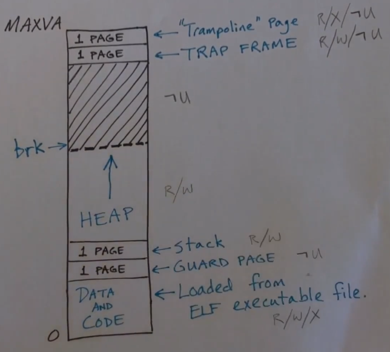

# 设备

cpu 多核心共享主存

异步接收发送器

磁盘

时钟中断，平台级中断控制器，本地中断控制器。

# 内存管理

内存 128Mbytes

物理页大小4096bytes，物理页有标记，r读/w写/x执行/u用户访问模式/v有效性

内存分配按照页来分，没有动态大小内存分配。

三级页表。每个进程有各自的页表。内核有一个页表映射了所有物理内存，所有核心共享。

# 进程调度

时间片轮转，时间片用完的进程回到就绪队列。所有核心共享同一个就绪队列。

# 系统引导

qemu 模拟  
加载内核代码到物理内存地址0x8000_0000，执行

# 锁

自旋锁，锁被占用则忙等。

睡眠锁，锁被占用则结束当前进程时间片

# 用户地址空间

虚拟地址空间，并不是全部映射到物理地址的。只有需要使用的地址才映射为物理内存地址。

以页为单位分配地址空间

exec系统调用，内核访问文件系统找到ELF可执行文件，分配若干物理页，并将文件加载到内存上。

virt Addr size $2^{38} = 256 G$

Trampoline 各个进程共享

TRAP FRAME 保存当前进程寄存器

栈只有一页大小

# RISC-V

机器模式，xv6初始化

监管模式，运行内核代码

用户模式，运行用户代码

机器模式和监管模式下可操作状态寄存器。

RISC-V 架构有 32 个通用寄存器（在 RV32 和 RV64 中），每个寄存器的宽度取决于架构的位数（RV32 为 32 位，RV64 为 64 位）。此外，还有一些特殊用途的寄存器。以下是详细介绍：

---

## **通用寄存器**
每个通用寄存器的编号为 `x0` 到 `x31`，同时有对应的 ABI（Application Binary Interface）名称和惯用用途。  

| **寄存器编号** | **ABI 名称** | **用途**                   | **特殊描述**                      |
|----------------|--------------|----------------------------|------------------------------------|
| `x0`           | `zero`       | 常量 0                     | 读操作始终返回 0，写操作无效      |
| `x1`           | `ra`         | 返回地址（Return Address） | 用于保存跳转返回地址（如 `jal`）  |
| `x2`           | `sp`         | 栈指针（Stack Pointer）    | 指向栈的顶部                      |
| `x3`           | `gp`         | 全局指针（Global Pointer） | 指向全局变量区域                  |
| `x4`           | `tp`         | 线程指针（Thread Pointer） | 指向线程本地存储                  |
| `x5`-`x7`      | `t0`-`t2`    | 临时寄存器（Temp）         | 调用者保存，供临时计算使用        |
| `x8`           | `s0`/`fp`    | 保存寄存器 0 / 帧指针      | 调用者保存，可用作帧指针          |
| `x9`           | `s1`         | 保存寄存器 1               | 调用者保存                        |
| `x10`-`x17`    | `a0`-`a7`    | 函数参数 / 返回值          | 用于传递参数和返回值              |
| `x18`-`x27`    | `s2`-`s11`   | 保存寄存器（Saved）        | 被调用者保存                      |
| `x28`-`x31`    | `t3`-`t6`    | 临时寄存器（Temp）         | 调用者保存，供临时计算使用        |

---

## **特殊用途寄存器**

### 1. **程序计数器（PC, Program Counter）**
- 保存当前指令的地址。
- 在执行每条指令后，`PC` 自动更新为下一条指令的地址（或者通过跳转指令改变）。

---

### 2. **控制与状态寄存器（CSR, Control and Status Registers）**
RISC-V 提供了一系列用于控制和状态管理的寄存器，常见的有：
- **`mstatus`（机器模式状态寄存器）**: 管理全局状态，如中断使能、特权级别等。
- **`mcause`**: 描述异常或中断的原因。
- **`mepc`**: 保存异常发生时的返回地址。
- **`mtvec`**: 中断向量基地址。
- **`mscratch`**: 临时保存机器模式的数据。

**监管模式的主要 CSR**
| **CSR 名称** | **地址 (十六进制)** | **功能描述**                                                                 |
|--------------|----------------------|------------------------------------------------------------------------------|
| `sstatus`    | 0x100                | **监管模式状态寄存器**，保存中断使能、当前特权级别等状态信息                  |
| `sie`        | 0x104                | **监管模式中断使能寄存器**，控制各类中断的使能位                              |
| `stvec`      | 0x105                | **中断向量基地址寄存器**，定义异常或中断的入口地址                            |
| `scounteren` | 0x106                | **计数器使能寄存器**，控制用户模式对计数器（`time`、`instret` 等）的访问权限 |
| `sscratch`   | 0x140                | **临时保存寄存器**，供监管模式下异常处理程序使用                              |
| `sepc`       | 0x141                | **异常程序计数器**，保存异常或中断发生时的返回地址                            |
| `scause`     | 0x142                | **异常原因寄存器**，保存引发异常或中断的原因                                  |
| `stval`      | 0x143                | **异常附加信息寄存器**，保存与异常或中断相关的附加信息（例如故障地址）        |
| `satp`       | 0x180                | **地址翻译与保护寄存器**，配置虚拟内存系统           

---

## **寄存器分类与职责**

| **分类**        | **寄存器范围** | **描述**                                                    |
|------------------|----------------|------------------------------------------------------------|
| 常量寄存器       | `x0`           | 固定为 0，常用于初始化或清零                                |
| 返回地址         | `x1 (ra)`      | 保存函数调用的返回地址                                      |
| 栈指针           | `x2 (sp)`      | 指向栈的顶部，用于栈操作                                    |
| 全局/线程指针    | `x3 (gp)`      | 用于全局数据访问                                           |
| 临时寄存器       | `x5-x7, x28-x31` | 调用者保存，可随时使用，性能敏感                           |
| 保存寄存器       | `x8 (fp), x9, x18-x27` | 被调用者保存，跨函数调用保持值                             |
| 参数/返回值寄存器| `x10-x17`       | 用于函数的参数传递和返回值存储                             |

---

## **注意事项**
1. **调用约定**:
   - 临时寄存器 (`t0-t6`) 在函数调用间不保持值。
   - 保存寄存器 (`s0-s11`) 在函数调用间需要保持值。

2. **零寄存器（x0）**:
   - `x0` 的值始终为 0，因此常用于:
     - 清零：`add x5, x0, x0`（将 `x5` 清零）。
     - 比较或条件判断。

## ecall

`ecall` 是 RISC-V 中用于触发特权服务调用的指令，其主要作用是从用户态（或低特权模式）请求操作系统提供服务。执行 `ecall` 后，处理器会切换到更高特权级别（例如超级模式或机器模式），进入异常处理流程。RISCV 不支持中断嵌套，即中断触发之后会将 `sstatus` 的 `mie` 位置 0。`ecall`后中断关闭，`sret`后中断开启。

以下是 `ecall` 执行后通常会涉及的几个关键步骤：

---

### **1. 触发异常**
- **异常类型**:
  - 当 `ecall` 被执行时，处理器会生成一个同步异常（同步陷阱）。
  - 异常类型被记录在 **`scause`** 或 **`mcause`** 寄存器中：
    - 如果在用户态执行 `ecall`，`scause` 的值为 `8`（Environment call from U-mode）。
    - 如果在超级态执行 `ecall`，`scause` 的值为 `9`（Environment call from S-mode）。
    - 如果在机器态执行，`mcause` 的值为 `11`。

---

### **2. 保存当前程序状态**
- **保存地址**:
  - 当前指令地址（`PC`）会被保存到特定的异常保存寄存器：
    - 用户态：`sepc`
    - 超级态：`mepc`
- **其他状态**:
  - 处理器保存必要的程序状态以便异常处理完成后能够恢复。

---

### **3. 切换到特权模式**
- 处理器根据当前模式和陷阱类型，切换到更高的特权模式（例如从用户态切换到超级态）。
- 使用陷阱向量表的入口地址（由 `stvec` 或 `mtvec` 寄存器指定）跳转到异常处理程序。

---

### **4. 执行异常处理程序**
- 异常处理程序通常根据寄存器传递的参数，执行特定的服务逻辑：
  - **`a7`**: 系统调用号，用于区分请求的服务类型。
  - **`a0` 至 `a5`**: 传递输入参数或返回值。
- 处理程序解析系统调用号，执行相应的内核服务，例如：
  - 文件读写
  - 内存分配
  - 进程管理
  - IO 操作
- 服务完成后，设置返回值到 `a0` 寄存器。

---

### **5. 恢复状态并返回**
- 异常处理完成后，恢复之前保存的程序状态：
  - 从 `sepc` 或 `mepc` 恢复返回地址。
  - 调整 `PC` 以跳过触发异常的 `ecall` 指令。
- 使用 `sret`（超级态）或 `mret`（机器态）指令返回到触发 `ecall` 的用户态程序。

---

# 页表

页表存在主存中，每个进程都有独立的页表。

内核中有一个所有核心共用的页表，通常将虚拟地址直接映射到对应的物理内存，此外也映射了一些其他IO设备。

39位地址，三级页表，每一级9位，地址低12位为物理页内偏移，物理页大小4kB。

页表共有$2^9=512$页表项，页表大小4kB，每一项有8Bytes。页表项存储的是物理地址。所以如果页表项存的是另一个页表的地址，则不需要经过页表转化。

切换页表需要刷新TLB缓存，这是一些缓存页表的寄存器。

# 陷阱处理

## **中断与陷阱的对比**

| **特性**          | **中断 (Interrupt)**                   | **陷阱 (Trap)**                         |
|-------------------|----------------------------------------|-----------------------------------------|
| **触发方式**      | 异步，由外部事件或硬件触发            | 同步，由指令流或程序行为触发            |
| **来源**          | 硬件设备（如 I/O、定时器）            | 软件（系统调用）、指令异常              |
| **与指令关系**    | 与当前指令无关                        | 与当前指令密切相关                      |
| **用途**          | 响应外部事件、硬件管理                | 异常处理、系统调用、程序错误检测        |
| **恢复方式**      | 通常在中断处理完成后恢复              | 根据情况可能重新执行或终止指令           |

---

## **联系与区别**
1. **共同点**:
   - 都会引发特权级切换（如从用户态切换到内核态）。
   - 都需要保存处理器的上下文状态。
   - 都通过特定的处理程序来处理事件。

2. **区别**:
   - 中断是由外部异步事件触发，独立于当前程序。
   - 陷阱是由内部同步事件触发，与当前程序的执行有关。

---

# 切换上下文

多核多进程，任何进程的时间片都有可能在任意一个核心上运行。
